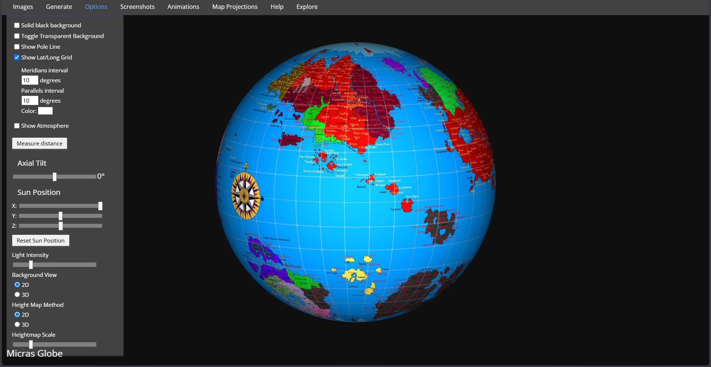

# 🌍 Micras Globe

Spin the Micras map as a 3D globe and measure the real distance between any two places on it.

**Live: https://eddyplolz.github.io/micras-globe/**



The Micras map is flat. This wraps it around a sphere you can turn, light, and click to measure.

## What is Micras?

New here? Micras is a made-up world that a community of online worldbuilders has built together over
the past couple of decades. People start their own countries on it, draw the borders, and write the
history, agreeing among themselves where everything sits on the map.

It began as a micronationalism hobby (running small, mostly-online "nations" for fun) and grew into a
full shared planet with its own geography and politics. The map here is the community's official one,
looked after by the Micras Cartography Society (MCS).

Explore Micras:

- [Micras](https://micras.org): the community's main site.
- [MicrasWiki](https://micras.org/mwiki/): the encyclopedia. Nations, history, geography, lore.
- [Micras Cartography Society](https://micras.org/mwiki/Micras_Cartography_Society): the people who make and keep the map.
- [Community forum](https://hub.mn/forum): where members talk, plan, and roleplay.

## What it does

- Shows the current Micras map on a globe, loaded automatically. No upload needed.
- Measures true great-circle distance in kilometers, miles, and nautical miles.
- Reads out latitude, longitude, and the compass bearing for each point.
- Estimates travel time across many modes, from a marching army to a low-orbit ground track (speeds are editable).
- Traces multi-leg paths with a running total, and measures the area of a region you draw.
- Draws **range rings** around any point — missile ranges, nuclear blast rings by yield, a custom radius, a launch site's rotational assist to orbit, or a **downwind nuclear-fallout plume** with dose-rate bands (set wind direction and speed).
- Draws a day/night boundary that follows the globe's manual sun-position controls without pretending to show a canonical current time.
- Copies a shareable link that restores the same camera angle, zoom, and panned center.
- Drops **named pins** — click the globe to mark capitals, landmarks, or event sites with a labeled marker. Pins are saved in your browser and reload on your next visit.
- Adds a lat/long grid, flat-map projections (Mercator, Mollweide, more), atmosphere and lighting, and screenshot and GIF export.

## How to use it

- Rotate: left-click and drag.
- Zoom: mouse wheel.
- Pan: right-click and drag.
- Measure: open the **Measure** tab, click **Measure distance**, then pick **Distance**, **Path**, **Area**, or **Rings**.
- Rings: in **Rings** mode, click a center point, then choose a preset (missile range, nuclear yield, custom radius, or launch site).
- Day/night boundary: open **Environment**, enable **Show day/night boundary**, then move the Sun Position sliders.
- Share a view: frame the globe, open **View**, and select **Copy current view link**.
- Pins: open the **Pins** tab, click **Add pin**, then click the globe to drop a labeled marker. Rename it in the list, click its color swatch to recolor, or delete it. Pins are saved in your browser only.
- Different map: open **Images** and upload any 2:1 (equirectangular) picture.
- Keyboard: Tab moves between menu items, Enter or Space opens one.

The controls sit in tabs: Measure, Pins, View, Environment, Terrain, plus Images, Generate, Screenshots,
Animations, and Map Projections. On a phone the tab bar scrolls sideways — swipe it to reach the
tabs that do not fit.

## What the presets assume

The Measure presets are sized for worldbuilding, not for analysis. What each one actually models:

- **Missile rings** use the standard range-class boundaries — 1,000 km (SRBM), 3,000 km (MRBM),
  5,500 km (IRBM), 12,000 km (ICBM). They are representative maxima for a class, not the range of
  any particular weapon.
- **Blast rings** scale from published ~1 kt airburst references: cube-root scaling for the
  overpressure radii, separate exponents for fireball and thermal. Approximate, for scale.
- **Fallout plumes** are an illustrative parametric shape, not a dispersion simulation. Band length
  scales with the square root of yield and with wind speed; width with the square root of yield.
  Real fallout depends on upper-air weather, terrain, and shelter.
- **Travel times** are editable planning assumptions. Mechanical modes are sustained cruising
  speeds and count no stops, so a short trip reads as a nonstop journey.
- **Launch assist** uses Micras's own rotation: a 6,875 km radius and a 24-hour solar day give an
  equatorial speed of about 500 m/s, falling off with the cosine of latitude.

About the numbers: distances are true great-circle and accurate at every range, using Micras's
canonical planetary radius of 6,875 km (per the MicrasWiki "Micras" infobox). Latitude runs from the pole. Longitude is measured east or
west of the map's center, a convention of this tool since Micras has no official prime meridian.

## Run it yourself

Just static files. No server, no build step.

```bash
npx serve .
```

Open the link it prints. To host your own copy, drop these files on any static host (GitHub Pages,
Netlify, whatever you like).

The measurement math (great-circle distance, bearings, spherical area, blast/fallout scaling) lives
in `js/measure-core.js` as pure functions, pinned by a dependency-free Node suite. From the project
root:

```bash
node tests/measure-core.test.js
```

## Credits

The globe, the measuring, the projections, the exports, and the shaders are all the work of
MapToGlobe. This project just wraps it for Micras.

- MapToGlobe by Kurt Peters (the original) and Tom Bowyer ([@Zeerg](https://github.com/Zeerg), current
  maintainer). Released under the [Mozilla Public License 2.0](https://choosealicense.com/licenses/mpl-2.0/).
  Source: [github.com/Zeerg/MapToGlobe](https://github.com/Zeerg/MapToGlobe). Try the original at
  [maptoglobe.com](https://www.maptoglobe.com/).
- The glow and atmosphere shader is adapted from Lee Stemkoski's Three.js "Shader Glow Effect" example.
- The Micras map is by the [Micras Cartography Society](https://micras.org/mwiki/Micras_Cartography_Society)
  and its mapmakers.

Built and hosted by Eddy ([@eddyplolz](https://github.com/eddyplolz)), with
[Claude](https://www.anthropic.com/claude) (Anthropic's Claude Code) helping pull the source, adapt it
for Micras, and set up the static build and deployment.

Libraries used, each under its own open license: Three.js, jQuery, D3 with d3-geo-projection, gif.js,
JSZip, Remodal, colpick, seedrandom, simplex-noise, async.js, and the Three.js OrbitControls,
ShaderTerrain, and Detector helpers.

## What's different here

Compared to the original MapToGlobe:

1. Opens straight onto the Micras map, at Micras scale.
2. Drops everything that needed a server: the old save and share links, the imgur upload, and the
   analytics. It runs as plain files, no backend, no tracking.
3. Fixes the file paths for static hosting and renames itself "Micras Globe."

Everything specific to Micras lives in one small file, `js/micras-defaults.js`. The rest of MapToGlobe
is left as it was.

## License and takedown

MapToGlobe is under the MPL-2.0 (see Credits), and this build follows the same terms. It is here for
the Micras community to use. If you are Kurt Peters or Tom Bowyer and want the credit changed, or this
copy taken down, [open an issue](https://github.com/eddyplolz/micras-globe/issues) and it will be
sorted out quickly.
